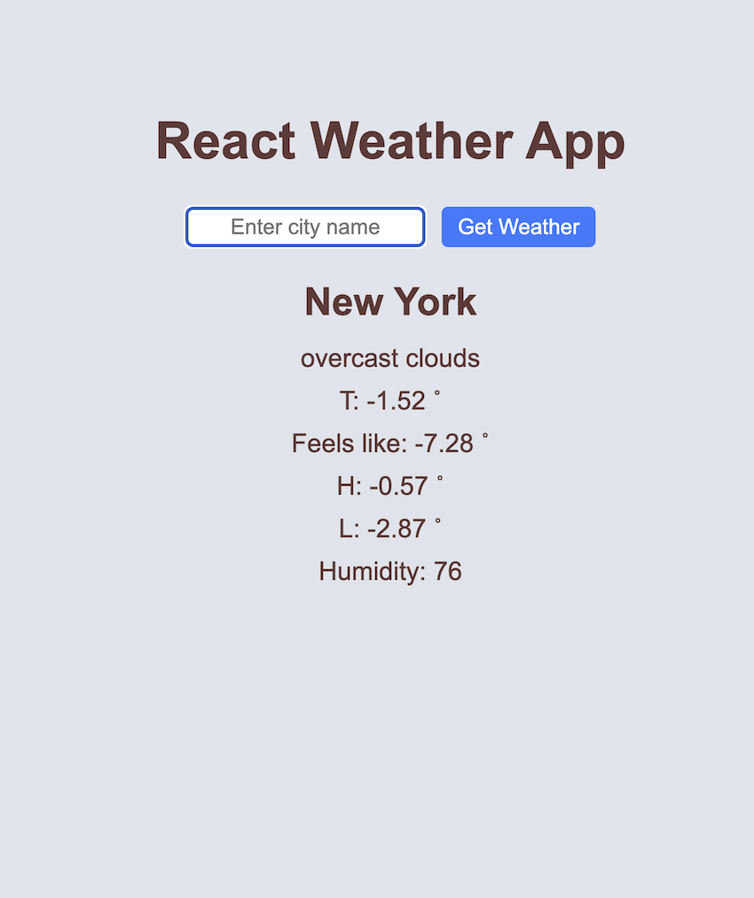

# React Weather App

This is a Weather app with React.



## Features
Getting the weather information of the city user have chosen.

## Technologies Used
- HTML5
- CSS
- JavaScript
- React.js

## How to use

0. At [OpenWeatherMap](https://openweathermap.org/) generate a API key.

1. Clone the repository to your local machine:

   ```bash
   git clone https://github.com/[your-user-name]/react-weather-app.git

2. Navigate to the project directory:

   ```bash
   cd react-weather-app

3. Install the project dependencies:

   ```bash
   npm install

4. Create a .env file and in the file create a variable called VITE_WEATHER_API_KEY with the value as your API key. 

5. Start the development server::

   ```bash
   npm run dev

5. Open your web browser and go to http://localhost:5173/ to view the app.
